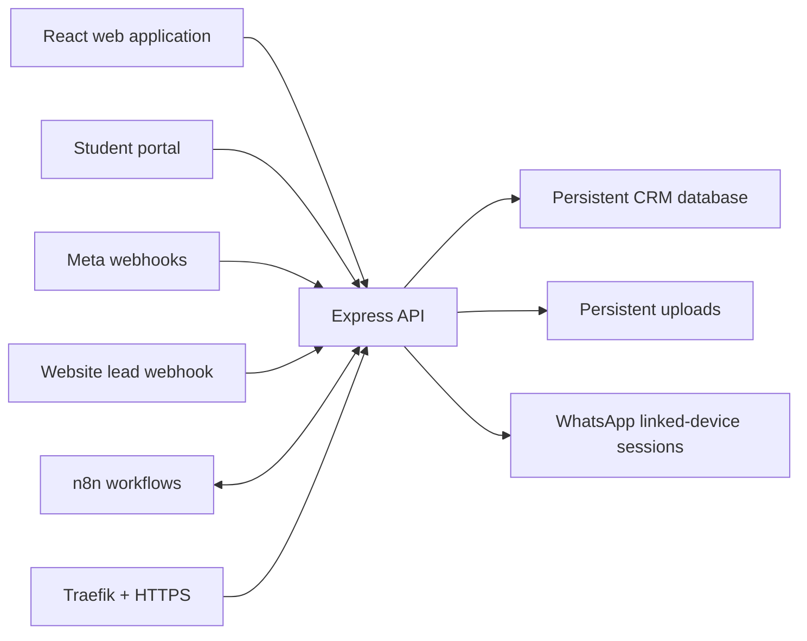

# EduExpress CRM

[](https://github.com/rakibnuist/eduexpress-crm/actions/workflows/ci.yml)
[](https://nodejs.org/)
[](https://react.dev/)
[](https://crm.eduexpressint.com)

EduExpress CRM is the internal consultancy operations and client lifecycle
platform for **EduExpress International**. It brings lead management,
application processing, omnichannel communication, student services, finance,
HR, marketing, and operational reporting into one secured workspace.

**Production:** [crm.eduexpressint.com](https://crm.eduexpressint.com)

## Core capabilities

| Area | Capabilities |
|---|---|
| Leads and pipeline | Kanban and table views, lead scoring, assignment, routing, tags, follow-ups, duplicate handling, and bulk import |
| Applications | Admission-stage tracking, document checklists, intake management, university details, and withdrawal workflows |
| Conversations | Unified WhatsApp, Messenger, and Instagram inbox with media, notes, assignment, priority, tags, and SLA controls |
| Student portal | Token-based status tracking, document exchange, messages, and application progress |
| Marketing | Content planning, AI-assisted drafts, publishing queue, templates, broadcasts, Meta integrations, and advertising performance |
| Automation | Message rules, status-change actions, scheduled broadcasts, routing rules, follow-up reminders, and internal notifications |
| Finance | Income and expense ledger, payments, balances, cash flow, and profit-and-loss reporting |
| HR | Employee management, attendance, workspace logs, salary controls, and payroll |
| Reporting | Operational dashboards, consultant performance, applications, conversions, finance, and management summaries |

## Architecture



The frontend is built with React and Vite. The Express server serves the
production build, API, webhooks, uploaded media, and real-time events. CRM data
is stored in a SQLite-compatible database through `sql.js`, with atomic
persistence and validated backup/restore handling.

## Technology

| Layer | Technology |
|---|---|
| Frontend | React 19, Vite 8, Tailwind CSS 4, Lucide React |
| Backend | Node.js 22, Express 5 |
| Database | SQLite-compatible persistence with `sql.js` |
| Real-time | Server-Sent Events and WebSocket integrations |
| Messaging | Meta Graph API and Baileys linked-device support |
| Charts and reporting | Recharts and SheetJS |
| Production | Hostinger VPS, Docker Compose, Traefik, Let's Encrypt |
| Quality | ESLint, Node test runner, GitHub Actions |

## Project structure

```text
.
├── src/                    React application
│   ├── components/         Shared interface components
│   ├── hooks/              Reusable React hooks
│   ├── lib/                Formatting, phone, and role helpers
│   └── pages/              CRM modules and public pages
├── public/                 Static assets
├── tests/                  Automated database safety tests
├── server.js               Express API, webhooks, jobs, and integrations
├── sqldb.js                Database compatibility and persistence layer
├── wa-linked.js            WhatsApp linked-device manager
├── docker-compose.yml      Hostinger production service definition
├── Dockerfile              Reproducible production image
└── DEPLOY.md               Production deployment and recovery guide
```

Generated builds, databases, backups, uploads, environment files, logs, and
WhatsApp sessions are intentionally excluded from Git and Docker build context.

## Local development

### Requirements

- Node.js 22.13 or newer
- npm

### Setup

```bash
git clone https://github.com/rakibnuist/eduexpress-crm.git
cd eduexpress-crm
npm ci
cp .env.example .env
```

Fill only the integrations required for the local task. Never place production
secrets or production databases in the repository.

Run the frontend and API together:

```bash
npm start
```

The Vite development server proxies API, upload, and webhook requests to the
local Express server.

### Available commands

| Command | Purpose |
|---|---|
| `npm run dev` | Start the Vite frontend |
| `npm run server` | Start the Express API |
| `npm start` | Start frontend and API together |
| `npm run lint` | Run static code checks |
| `npm test` | Run automated database tests |
| `npm run build` | Create the production frontend build |
| `npm run check` | Run lint, tests, and production build |
| `npm run start:production` | Serve the built application in production mode |

## Configuration

Copy `.env.example` to `.env`. The application has no committed credentials and
does not use fallback production secrets.

### Required production secrets

| Variable | Purpose |
|---|---|
| `JWT_SECRET` | Signs authenticated CRM sessions |
| `RESET_KEY` | Protects the emergency administrator reset endpoint |
| `INTERNAL_API_KEY` | Authenticates trusted internal and n8n requests |
| `WEBSITE_WEBHOOK_SECRET` | Authenticates website lead submissions |
| `META_APP_SECRET` | Validates Meta webhook signatures |

### Runtime and optional integrations

| Variable | Purpose |
|---|---|
| `PORT` | API port; Docker uses `3000` |
| `DB_PATH` | Persistent database path; Docker uses `/data/crm.db` |
| `META_WEBHOOK_VERIFY_TOKEN` | Meta webhook verification token |
| `CORS_ORIGINS` | Optional comma-separated allowed browser origins |
| `RUN_DATA_BACKFILLS` | Opt-in historical data jobs; keep `false` normally |
| `OPENAI_API_KEY` | Optional OpenAI integration |
| `GEMINI_API_KEY` | Optional Gemini integration |
| `OPENCODE_GO_API_KEY` | Optional OpenCode integration |
| `LLM_PROVIDER` | Selected AI provider |
| `LLM_MODEL` | Selected AI model |
| `N8N_PUBLISH_WEBHOOK` | Optional publishing workflow |
| `N8N_WELCOME_WEBHOOK` | Optional welcome-message workflow |

## Security and data protection

- Authentication state is validated against the current active user and roles.
- Administrative, finance, HR, integration, import, and automation operations
  use server-side role checks.
- Meta webhooks use HMAC signature validation.
- Public lead and portal endpoints are rate-limited and input-constrained.
- Uploads use type, content, size, name, and access validation.
- Sensitive integration values are masked in API responses.
- Database writes are persisted atomically and transaction rollback is tested.
- Historical data backfills are disabled unless explicitly enabled.

Production database files, backups, uploaded documents, restore files, logs,
secrets, and WhatsApp sessions must never be committed.

## Production deployment

Production runs on the Hostinger VPS using Docker Compose and the existing
Traefik HTTPS proxy. The database, uploads, and WhatsApp linked-device state are
stored in persistent Docker volumes and survive container rebuilds.

Follow [DEPLOY.md](DEPLOY.md) for the deployment procedure, environment setup,
health checks, and mandatory data-safety rules.

> Never run `docker compose down -v` in production. The `-v` option deletes
> persistent volumes.

## Webhooks

| Integration | Endpoint |
|---|---|
| Meta Messenger, Instagram, WhatsApp, and Lead Ads | `https://crm.eduexpressint.com/webhook/meta` |
| Website lead intake | Configured protected API endpoint with shared-secret authentication |

Integration credentials and page/channel configuration are managed from
**Settings → Integrations**.

## Quality assurance

Every pull request and push to `main` runs:

```bash
npm ci
npm run check
```

This validates lint rules, database transaction behavior, corrupt database
rejection, and the complete production frontend build.

## License

Proprietary software. Copyright © EduExpress International. All rights reserved.
